# SentinelAgent — Present Model, Target Model & Gap Analysis

**Problem statement:** SIH26171 — *On-device Visual Perception for Light-weight Browser Agents* (ISRO / Dept. of Space)
**Doc date:** 2026-09-28
**Scope:** the single largest risk in this project is not the code — it is the **distance between the mental model (what the deck and README assert) and the logic model (what the code actually executes)**. This document pins down all three layers.

---

## Table of Contents

1. [The Three Models](#1-the-three-models)
2. [Present Model — As-Built](#2-present-model--as-built)
3. [Break Points in the Present Model](#3-break-points-in-the-present-model)
4. [Target Model — To-Build](#4-target-model--to-build)
5. [Data Model (ER)](#5-data-model-er)
6. [Redaction Decision Logic](#6-redaction-decision-logic)
7. [Agent Loop State Machine](#7-agent-loop-state-machine)
8. [Gap → Fix Traceability Matrix](#8-gap--fix-traceability-matrix)
9. [Build Roadmap](#9-build-roadmap)
10. [File Layout](#10-file-layout)

---

## 1. The Three Models

| Layer | What it means | Where it lives |
| :--- | :--- | :--- |
| **Mental model** | What the team and judges believe the system does | `README.md`, the SIH deck, slide text |
| **Logic model** | The formal pipeline: inputs → transform → policy → output | The actual source |
| **Behaviour model** | What the browser does at runtime | Runtime only — measurable |

Today, **Mental ≠ Logic ≠ Behaviour.** All three divergences run in the same direction: the mental model is stronger than reality. Every critical fix below exists to close one of these gaps.

```mermaid
graph LR
    subgraph Today["TODAY — three models disagree"]
        M["MENTAL MODEL<br/>deck + README<br/>UI grounder, face blurring,<br/>14.5 MB, multi-key rotation"]
        L["LOGIC MODEL<br/>source code<br/>COCO-80 detector, faces discarded,<br/>no page-text scan, hardcoded memory"]
        B["BEHAVIOUR MODEL<br/>runtime<br/>DOM-only, single pass,<br/>no measured memory"]
    end
    M -.->|"asserts"| L
    L -.->|"degrades to"| B
    M ==>|"|x ==>| B
```

**Target: all three collapse into one.**

---

## 2. Present Model — As-Built

### 2.1 Component architecture (verified against source)

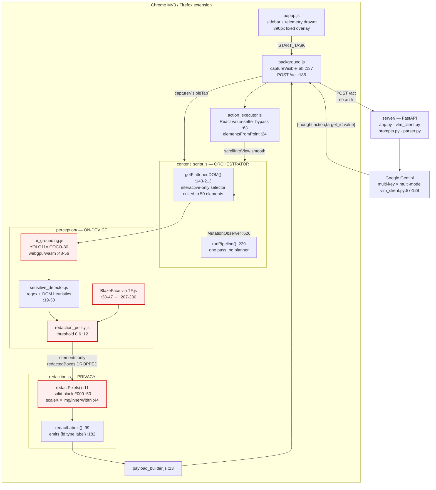

### 2.2 End-to-end sequence (one step)

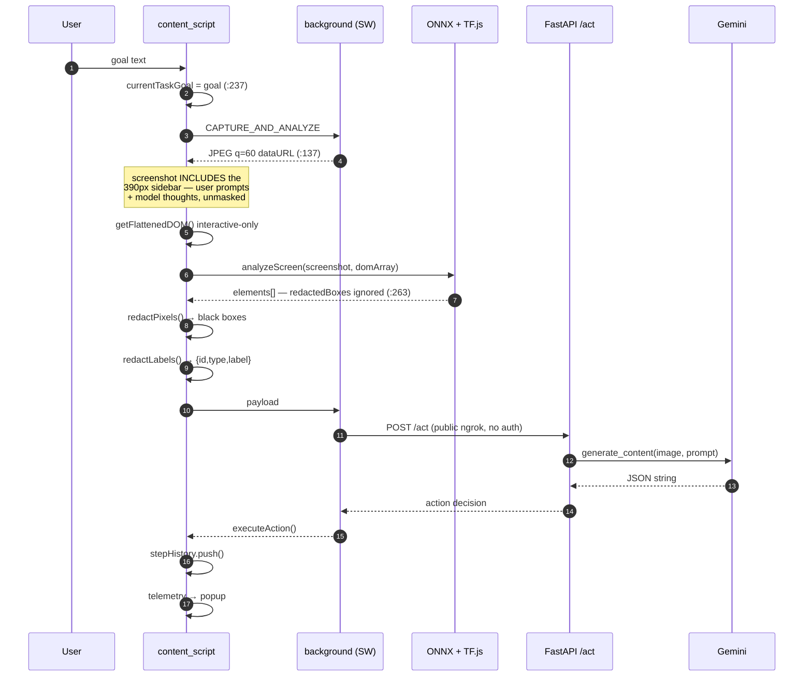

### 2.3 What is genuinely strong

Not everything here is broken. Protect these during refactor:

| Strength | Evidence | Why it matters |
| :--- | :--- | :--- |
| Payload minimisation | `redaction.js:182-186` emits only `{id,type,label}` | Server physically cannot receive a value. Structural, not policy-based, privacy. **This is the project's real asset.** |
| Role preservation | `type` retained while `label` is masked | Enables *acting* without *reading* — the genuine novelty claim |
| Coordinate math | `redaction.js:44-45` derives DPR from `naturalWidth / innerWidth` | Correct without ever touching `devicePixelRatio`. Verified accurate |
| YOLO pre/post-processing | `ui_grounding.js:284-315`, `320-367` | Letterbox and inverse-coordinate decode are mathematically correct for `[1,84,8400]` |
| React/Vue input injection | `action_executor.js:63-75` | Textbook native value-setter bypass |
| DOM grounding breadth | `content_script.js:143-152`, 25 selectors | Covers Google Forms, YouTube, ARIA widgets — better than any prior art |
| Label resolution cascade | `redaction.js:99-188`, 6 sources | Real semantic understanding of a page without OCR |

---

## 3. Break Points in the Present Model

Eight defects, each traced to source. **B1–B4 are blocking for evaluation.**

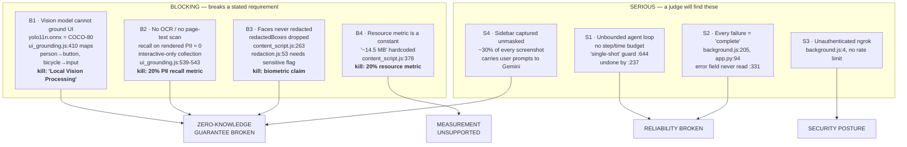

### Break point detail

| ID | Defect | Source | Impact |
| :--- | :--- | :--- | :--- |
| B1 | Stock COCO-80 detector used as UI grounder; `_mergeVisionWithDOM` discards every vision box unless IoU > 0.3 with a DOM node | `ui_grounding.js:408-431` | Local vision requirement unmet |
| B1b | `ort.env.wasm.wasmPaths` never set; `document.currentScript` is `null` in a content script | repo-wide, 0 hits | WebGPU/WASM likely never initialises → silent `dom-fallback` |
| B2 | No OCR anywhere. DOM scraper collects only interactive elements, then a second filter drops every `role=*` div | `content_script.js:143-152`, `ui_grounding.js:539-543` | Static Aadhaar/card text ships in the clear |
| B2b | `_normalizeDomInput` never copies `value` → the `element.value` regex branch is dead | `ui_grounding.js:91-98` | Unlabelled inputs holding card numbers are invisible |
| B3 | Face boxes → `redactedBoxes` → returned → **discarded**; `redactPixels` also requires a `sensitive` flag faces never carry | `perception.js:81`, `content_script.js:263`, `redaction.js:53` | Biometric claim false |
| B3b | `blazeface.load()` fetches from `tfhub.dev` with no timeout | `sensitive_detector.js:41` | Can hang first `analyzeScreen()` forever |
| B4 | Memory is a hardcoded string when `performance.memory` is absent; Chromium-only; measures whole content-script heap | `content_script.js:378`, `popup.js:354` | 20% metric scores zero |
| S1 | No step/wall-clock/spend cap; duplicate-action guard cannot detect A-B-A-B cycles; `pendingRerun` written but never read | `content_script.js:22, 237, 341-364, 644` | Unbounded paid loops; dropped user requests |
| S2 | Network error, quota exhaustion, malformed JSON and safety block all resolve to `action:"none"` → "Analysis complete" | `background.js:205`, `app.py:90-96`, `parser.py:51` | Failures invisible |
| S3 | Hardcoded public ngrok URL, no auth, no rate limit, `/docs` exposed | `background.js:4`, `app.py:10` | Free quota for anyone with the URL |
| S4 | Sidebar (prompts + model thoughts + screenshot thumb) captured every step, unredacted | `content_script.js:478-497`, `background.js:137` | Leak + 30% token waste + model reads its own prose |
| S5 | Server prints `0 sensitive fields redacted` always — counts fields the client strips | `app.py:47,63` vs `redaction.js:182` | "100% Zero-Leakage" is a constant |
| S6 | `prompts.py:36` teaches the model to return a *label* as `target_id` | `prompts.py:36` | Guaranteed registry miss → silent no-op |
| S7 | Multi-key rotation is a no-op (`.env` sets all 3 vars to one value); `gemini-3.5-flash*` are not real model IDs | `vlm_client.py:20-24` | Claimed resilience absent |
| S8 | `genai.configure()` mutates a module global in a threadpool | `vlm_client.py:97`, `app.py:41` | API key cross-talk |
| S9 | `perceptionEngineer/` and extension perception trees are duplicated **and diverged** (engineer copy has better tiled face detection) | both trees | Benchmark measures stale code |
| S10 | `navigate` auto-prefixes `https://`, no allow-list, **no confirmation UI** | `action_executor.js:100`, `background.js:156` | Prompt injection → arbitrary navigation |

---

## 4. Target Model — To-Build

### 4.1 Target component architecture

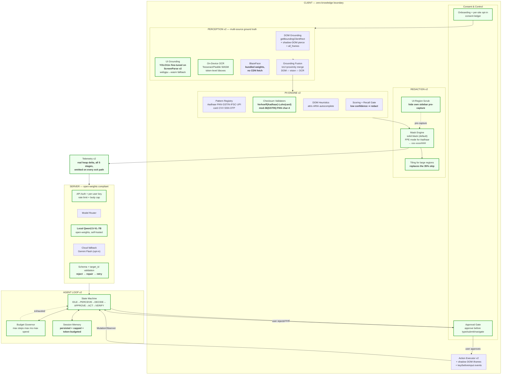

### 4.2 What is new vs. present

| # | Addition | Closes | Effort |
| :--- | :--- | :--- | :--- |
| 1 | Pass `redactedBoxes` → `redactPixels`; tag face boxes `sensitive:true` | **B3** | ~3 lines |
| 2 | Delete `ui_grounding.js:55-58` large-region skip; tile instead | redaction hole | ~30 lines |
| 3 | `redactPixels` gets an explicit `boxes[]` arg, not `elements[]` | B3, S5 | refactor |
| 4 | Server counts redactions from a client-sent **count + hashed type list**, not stripped fields | S5 | ~5 lines |
| 5 | Page-text scan: `TreeWalker` over `body` + regex sweep → bbox via `Range.getClientRects()` | **B2** | ~120 lines |
| 6 | Checksum validators (Verhoeff / Luhn / mod-36) behind a `validate()` interface | B2, Indian PII | ~80 lines |
| 7 | Pattern registry table (data, not code) | maintainability | ~60 lines |
| 8 | `ort.env.wasm.wasmPaths = chrome.runtime.getURL('libs/')` before session create | **B1b** | 1 line |
| 9 | Fine-tune YOLO11n on ScreenParse v2 → export → replace `models/yolo11n.onnx` | **B1** | offline, 1 day |
| 10 | Budget governor: `maxSteps`, `maxWallMs`, `maxSpendUsd` | **S1** | ~60 lines |
| 11 | Replace MutationObserver re-arm with an explicit FSM + VERIFY step | S1 | ~150 lines |
| 12 | `parse_action(..., valid_ids)`; reject → repair prompt → 1 retry | S2, S6 | ~50 lines |
| 13 | Propagate `error` distinctly; UI shows failure, not "complete" | **S2** | ~20 lines |
| 14 | Hide own UI before capture; restore after | **S4** | ~25 lines |
| 15 | `SharedSecret` handshake on `/act`; `slowapi` rate limit; body cap | **S3** | ~40 lines |
| 16 | Real heap delta: `usedJSHeapSize` before/after inference; Firefox → `performance.measureUserAgentSpecificMemory()` | **B4** | ~30 lines |
| 17 | Persist `stepHistory` to `storage.session`, cap 20, drop `thought` echo, token budget | S1 | ~40 lines |
| 18 | Local Qwen2.5-VL path behind the same `ModelRouter` interface | **PS compliance** | ~200 lines |
| 19 | Approval gate for `type`/`submit`/`navigate` with value preview | S10, real-world | ~120 lines |
| 20 | `navigate` URL allow-list + scheme validation | S10 | ~25 lines |
| 21 | Delete `perceptionEngineer/` or generate it from the extension tree | **S9** | build step |
| 22 | Bundled BlazeFace weights (no `tfhub.dev`) | B3b, privacy | ~5 MB asset |

### 4.3 Deliberate removals

| Remove | Reason |
| :--- | :--- |
| `_mapYOLOClassToType` COCO→UI table (`:410`) | Semantically false. Replace with model class map read from ONNX metadata |
| Large-region `continue` in `redactPixels` (`:56`) | Ships PII in the clear while claiming redaction |
| `blazeface.load()` CDN default | Undeclared third-party fetch; can hang the pipeline |
| `USE_REAL_SERVER` dead branch (`background.js:3,207-218`) | Unreachable |
| `analyzeScreen_MOCK` + stale TODO (`content_script.js:36-44`) | Unreachable; hardcoded bboxes |
| `pendingRerun` (`:22`) | Written, never read — silently drops requests |
| `sample_data.js` from the extension bundle | 0 references |
| `gemini-3.5-flash-lite`, `gemini-3.5-flash` | Not real model IDs; burn a round-trip each |
| Fabricated memory constants (`:378`, `popup.js:354`) | Metric fraud |
| Console logs of payload + typed values | Observable by the host page |

---

## 5. Data Model (ER)

### 5.1 Present wire contract

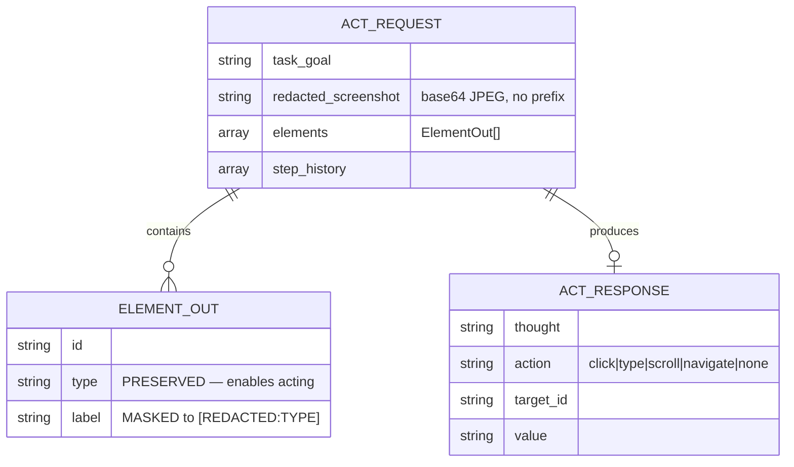

**This contract is correct and should not change.** `sensitive`, `pii_type`, `bbox`, `text`, `value` are structurally absent — the server *cannot* receive a value. That is the project's strongest security property.

### 5.2 Target internal data model

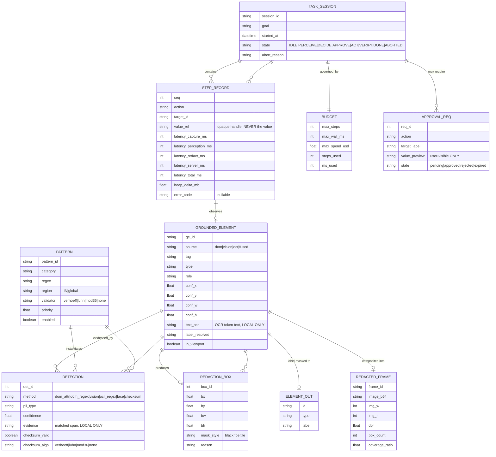

### 5.3 The trust boundary

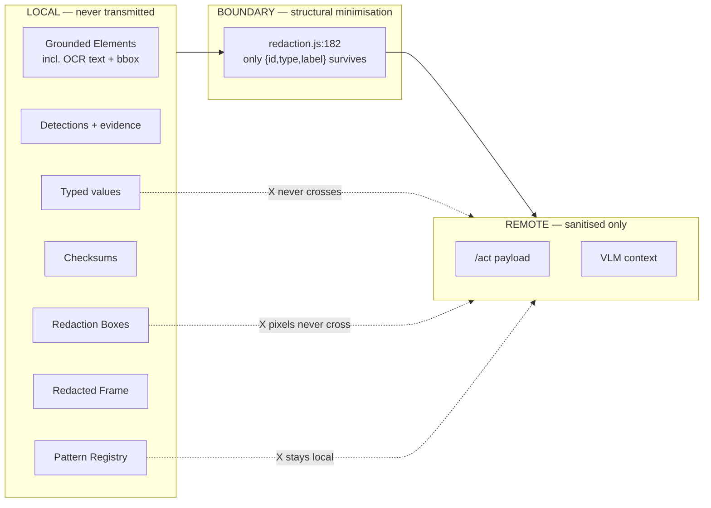

---

## 6. Redaction Decision Logic

### 6.1 Present (broken)

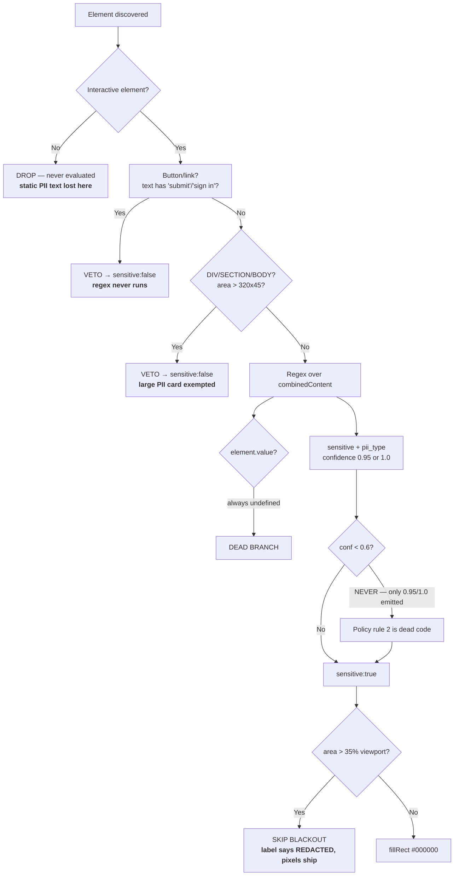

### 6.2 Target

```mermaid
flowchart TD
    subgraph GROUND["GROUNDING — any visible text, not just controls"]
        A[Scan all in-viewport nodes<br/>+ shadow roots + all_frames]
        A --> A1[DOM: getBoundingClientRect<br/>no interactive filter]
        A --> A2[OCR: token-level bboxes<br/><b>NEW — covers canvas, images, static text</b>]
        A --> A3[VISION: fine-tuned UI model<br/><b>NEW — real element classes</b>]
    end
    A1 --> FUSE
    A2 --> FUSE
    A3 --> FUSE
    FACE[BlazeFace, bundled weights] --> FUSE
    FUSE[Grounding Fusion<br/>IoU 0.5 + proximity join]

    FUSE --> D1[DETECTION — parallel, all sources]
    D1 --> D1a[DOM attrs: type, autocomplete, ARIA]
    D1 --> D1b[Regex: IN + global patterns]
    D1 --> D1c[OCR span match]
    D1 --> D1d[Face detection]
    D1 -->     D1e["Latency budget guard"]

    D1a --> VAL
    D1b --> VAL
    D1c --> VAL
    D1d --> VAL
    D1e --> VAL[CHECKSUM VALIDATION]
    VAL --> VAL1{Verhoeff<br/>(Aadhaar)}
    VAL --> VAL2{Luhn<br/>(card)}
    VAL --> VAL3{mod-36<br/>(GSTIN)}
    VAL --> VAL4{PAN 4th char<br/>entity whitelist}
    VAL1 & VAL2 & VAL3 & VAL4 --> SCORE

    SCORE[SCORING]
    SCORE --> S1[critical: password, card, CVV, Aadhaar, face<br/><b>always redact, no threshold</b>]
    SCORE --> S2[high: PAN, GSTIN, phone, email, DOB, address<br/>redact if conf >= 0.60]
    SCORE --> S3[medium: name, DOB, employer<br/>redact if conf >= 0.75]
    SCORE --> S4[unvalidated 12-16 digit run<br/><b>redact if conf >= 0.50 — safety-biased recall</b>]
    S1 & S2 & S3 & S4 --> MASK

    MASK[REDACTION]
    MASK --> M1[password, CVV, OTP, face → SOLID BLACK]
    MASK --> M2[Aadhaar → FPE xxxx-xxxx####<br/><b>UIDAI Reg. 21(mb) format</b>]
    MASK --> M3[area > 35% viewport → TILE into sub-regions<br/><b>replaces the skip</b>]
    MASK --> M4[default → SOLID BLACK + 6px pad<br/>re-encode PNG, not JPEG q0.6]

    MASK --> OUT[Emit ELEMENT_OUT + REDACTION_BOX]
    OUT --> AUD[Redaction ledger to USER UI:<br/>'4 fields redacted: 1 password, 1 Aadhaar, 2 email']
```

### 6.3 Indian PII validation rules

| Format | Structure | Validation | Note |
| :--- | :--- | :--- | :--- |
| Aadhaar | `[2-9]\d{3}\s?\d{4}\s?\d{4}` | **Verhoeff** checksum | Not mandated by UIDAI, but de-facto standard. High OCR-error rejection |
| PAN | `[A-Z]{5}\d{4}[A-Z]` | 4th char ∈ `ABCPFGHJKLMSTVX` entity whitelist | ~70% of alphabet invalid; cheap false-positive cut |
| GSTIN | `\d{2}[A-Z]{5}\d{4}[A-Z][A-Z\d]Z[A-Z\d]` | **mod-36** check digit | Presidio describes this but does not compute it |
| IFSC | `[A-Z]{4}0[A-Z0-9]{6}` | format | — |
| UPI/VPA | `[\w.\-]{2,256}@[\w.\-]{2,64}` | format | — |
| Card | Visa/MC/Amex/Discover/Diners/JCB | **Luhn** | Fixes current Aadhaar-first misclassification |
| CVV | `\d{3,4}` | requires keyword prefix | Already correct |

---

## 7. Agent Loop State Machine

### 7.1 Present — MutationObserver-driven, unbounded

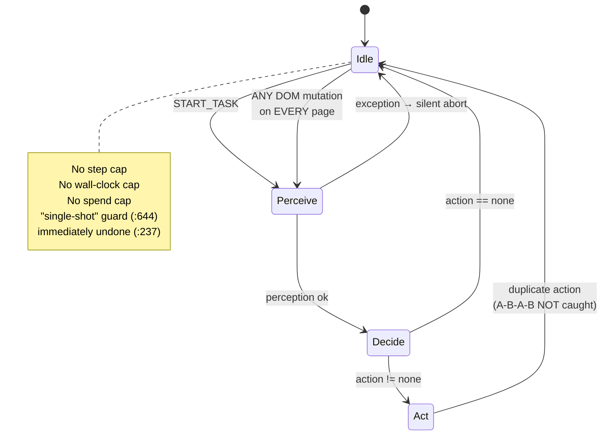

### 7.2 Target — explicit FSM with budget and verification

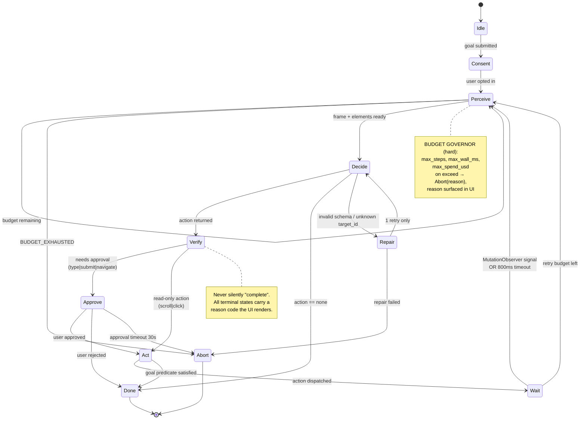

---

## 8. Gap → Fix Traceability Matrix

Traces every defect to a fix and to the ISRO evaluation metric it affects.

| Defect | Fix | Metric | Priority |
| :--- | :--- | :--- | :---: |
| B1 COCO-80 as UI grounder | Fine-tune on ScreenParse v2; read class map from ONNX metadata | 1 (25%) | **P0** |
| B1b `wasmPaths` unset | `ort.env.wasm.wasmPaths = chrome.runtime.getURL('libs/')` | 1 (25%) | **P0** |
| B2 No OCR / no text scan | `TreeWalker` + `Range.getClientRects()` span→bbox | 2 (20%) | **P0** |
| B2b `value` dropped | Copy `value` in `_normalizeDomInput`; OCR fallback | 2 (20%) | **P0** |
| B3 Faces not redacted | Pass `redactedBoxes` → `redactPixels`; tag `sensitive` | 3 (20%) | **P0** |
| B3b BlazeFace CDN | Vendor weights into `libs/` | 3, privacy | P1 |
| B4 Memory constant | Heap delta before/after inference | 4 (20%) | **P0** |
| Large-region skip | Tile sub-regions instead of `continue` | 3 (20%) | **P0** |
| `sensitive_count` always 0 | Client sends count + hashed type list | 3 (20%) | P1 |
| No page-text latency metric | Emit all 5 stages on every exit path | 5 (15%) | P1 |
| S1 Unbounded loop | Budget governor + FSM | 5, demo | **P0** |
| S2 Silent failure | Reason codes; never "complete" on error | demo | **P0** |
| S3 Open ngrok | Shared-secret auth, rate limit, body cap | security | **P0** |
| S4 Sidebar leak | Hide own UI pre-capture | 3 (20%) | **P0** |
| S5 Target_id hallucination | Validate against request ids; repair-retry | 1 (25%) | P1 |
| S6 Loop budget memory | Persist + cap + token-budget history | 1 | P1 |
| S7 No-op key rotation | Real key pool; remove invalid model IDs | 5 | P1 |
| S8 Key cross-talk | Per-request client, no global `configure` | security | P1 |
| S9 Diverged perception trees | Generate `perceptionEngineer` from source | maintainability | P2 |
| S10 No approval / no allow-list | Approval gate + URL allow-list | security | **P0** |
| Gemini ≠ open-weights | Local Qwen2.5-VL path | **PS compliance** | **P0** |

---

## 9. Build Roadmap

### Phase 1 — Make the claims true (1–2 days, ~15 lines)

Nothing here is new engineering. It is closing the distance between deck and code.

1. Pass `redactedBoxes` to `redactPixels`; tag face boxes `sensitive:true` → **B3**
2. `ort.env.wasm.wasmPaths` → **B1b**
3. Remove the large-region `continue` → redaction hole
4. Replace the `"~14.5 MB"` constant with a real heap delta → **B4**
5. Hide the sidebar before capture, restore after → **S4**
6. Propagate the `error` field so failures stop reading as success → **S2**

**Effect:** the biometric claim, the WebGPU claim, the resource metric and the zero-leakage claim all become true. Costs under a day.

### Phase 2 — Make the PII guarantee real (3–5 days)

7. `TreeWalker` page-text scan → span bboxes via `Range.getClientRects()` → **B2**
8. Verhoeff / Luhn / mod-36 validators → **B2**, and makes the Indian-PII claim real
9. Pattern registry as data
10. Bundle BlazeFace weights
11. Reorder patterns + Luhn so cards stop being labelled Aadhaar

**Effect:** recall on rendered PII goes from ~0 to genuinely high. This is the differentiator no competitor has.

### Phase 3 — Make it reliable (3–4 days)

12. Budget governor (steps / ms / spend) → **S1**
13. Replace MutationObserver re-arm with the explicit FSM + VERIFY
14. `parse_action(valid_ids)` + repair-retry → **S5**
15. Persist + cap + token-budget `stepHistory`
16. Per-request Gemini client; remove invalid model IDs

**Effect:** demos stop dying silently and stop burning quota in loops.

### Phase 4 — Make it secure and compliant (3–4 days)

17. Shared-secret auth + rate limit + body cap → **S3**
18. Approval gate for `type`/`submit`/`navigate` → **S10**
19. `navigate` URL allow-list + scheme validation
20. Remove payload/typed-value console logs
21. **Local Qwen2.5-VL path** behind `ModelRouter` → **PS compliance**

### Phase 5 — Prove it (parallel, 2–3 days)

22. **Evaluation harness** — labelled PII test set, IoU ≥ 0.30 protocol for pixel redaction, precision/recall per class. No browser-based detector has published this; it is the strongest single artefact you can produce.
23. **Masked-frame grounding experiment** — does blacking out 30% of a frame degrade VLM grounding? Measures the latency/accuracy trade-off the PS explicitly asks about. Note the `GUI-Perturbed` finding that browser zoom alone causes significant grounding degradation — so also test at 125%/150% zoom.
24. **Latency table** — capture / perception / redact / server / total, plus heap delta, on a fixed machine, across 3 page types.
25. Sync or delete `perceptionEngineer/`.

### Deferred (post-submission)

- Shadow DOM + cross-origin iframe traversal
- Streaming `stepHistory` summarisation
- Differential-privacy noise as a redaction mode
- Format-preserving encryption as a general mask style

---

## 10. File Layout

### 10.1 Present structure, annotated

```text
SIH/
├── README.md                                  ← overclaims; see §3
├── docs/
│   └── ARCHITECTURE.md                        ← this file
├── .gitignore
│
├── perceptionEngineer/                        ⚠ DUPLICATE + DIVERGED
│   ├── test.html                              standalone workbench
│   ├── test_custom.js                         Node CLI (forces backend:'dom',
│   │                                          so it can never test YOLO)
│   ├── sample.html                            fixture page
│   ├── sample/                                ★ de-facto PII test set
│   │   ├── face1.png  passport.png            seed the eval harness from these
│   │   └── raw.png  screenshot.png  Ss2.png  Ss3.png
│   ├── models/yolo11n.onnx                    10.9 MB (identical MD5 to ext copy)
│   └── perception/                            ⚠ 4/5 files have DIVERGED
│       ├── ui_grounding.js                     has tiled face detection the
│       │                                       extension DELETED — better code
│       ├── sensitive_detector.js               24-word keyword list; ext narrowed to 12
│       ├── redaction_policy.js                 no isAction exemption
│       ├── perception.js                       no text passthrough
│       └── sample_data.js                      byte-identical, 0 refs in ext
│
└── sentinel-agent-extension/
    ├── manifest.json                          host_permissions <all_urls>
    ├── manifest.firefox.json                  sidebar broken (no WAR, default_popup)
    ├── background.js:4                        ⚠ hardcoded public ngrok, no auth
    ├── content_script.js                      orchestrator; sidebar injected here
    │                                          ⚠ non-idempotent re-injection
    │                                          ⚠ pushState monkey-patch
    │                                          ⚠ :378 hardcoded "~14.5 MB"
    ├── redaction.js                           ★ core privacy layer
    │                                          ✓ :182-186 payload minimisation
    │                                          ✗ :56 large-region skip
    │                                          ✗ :53 faces never arrive
    ├── action_executor.js                     ✓ React value-setter bypass
    │                                          ✗ no key/beforeinput, no shadow DOM
    ├── payload_builder.js                     ✓ 4 keys, pass-through
    ├── popup.js / .html / .css                ⚠ dead STAGE_META; unescaped innerHTML
    ├── demo.html                              ISRO auth test portal
    ├── package_firefox.py / .xpi              ⚠ build artifact (gitignored)
    ├── FIREFOX_SETUP.md                        ⚠ claims parity Firefox lacks
    ├── icon16/48/128.png
    │
    ├── perception/                            ← LIVE tree
    │   ├── ui_grounding.js                    ✗ :410 person→button (COCO-80!)
    │   │                                       ✗ wasmPaths unset → dom-fallback
    │   │                                       ✗ :419 discards all vision boxes
    │   │                                       ✗ :91-98 drops `value`
    │   │                                       ✗ :539-543 drops all role=* divs
    │   ├── sensitive_detector.js              ✗ :41 CDN fetch, no timeout
    │   │                                       ✗ aadhaar regex before credit_card
    │   │                                       ✗ :116-128 container veto
    │   ├── redaction_policy.js                ✗ :38 conf<0.6 rule is dead code
    │   ├── perception.js                      ✗ :81 redactedBoxes returned…
    │   ├── sample_data.js                     ✗ DEAD — 0 references
    │   └── models/yolo11n.onnx                ✗ WRONG MODEL — COCO-80, not UI
    │
    ├── libs/                                  33 MB vendored runtime
    │   ├── ort.min.js                         ✓ ONNX Runtime Web 1.19.2
    │   ├── ort-wasm-simd-threaded.wasm        ⚠ never loaded (wasmPaths unset)
    │   ├── ort-wasm-simd-threaded.jsep.wasm   ⚠ never loaded
    │   ├── tf.min.js                          ✓ TF.js
    │   └── blazeface.min.js                   ✗ loads weights from tfhub.dev
    │
    ├── server/
    │   ├── app.py                             ✗ :47 sensitive_count always 0
    │   │                                       ✗ no auth, /docs exposed
    │   ├── vlm_client.py                      ✗ :97 global configure → key race
    │   │                                       ✗ :20-24 2 invalid model IDs
    │   ├── prompts.py                         ✗ :36 label-as-target_id
    │   ├── parser.py                          ✗ no target_id validation
    │   ├── requirements.txt
    │   ├── .env                               ✓ gitignored
    │   ├── test_payload.json                  ✗ PLACEHOLDER_BASE64 — unusable
    │   └── __pycache__/                       build artifact
    │
    └── docs/contracts.md                      ⚠ stale (missing `navigate`)
```

**Observations:**

| # | Finding |
| :-- | :-- |
| 1 | **33 MB of `libs/` is mostly dead weight** — the two `.wasm` binaries are never loaded because `wasmPaths` is unset |
| 2 | **`perceptionEngineer/` is a trap** — 4 of 5 files diverged, and it holds the *better* tiled face detector. Benchmarking it measures code that doesn't ship |
| 3 | **`perceptionEngineer/sample/` is a genuine asset** — `passport.png` + `face1.png` are real PII fixtures. Seed the eval harness here |
| 4 | **No `package.json`, no `tsconfig`, no `vite.config`, no test runner, no CI.** Everything is hand-loaded via `manifest.json` and `background.js:50-59` |
| 5 | **No `eval/` or `tests/`** — there is currently no way to measure any of the 5 ISRO metrics |
| 6 | **Two build artifacts on disk** — `.xpi` and `__pycache__` (gitignored, but noisy) |

### 10.2 Target structure

```text
SIH/
├── README.md                                  ← claims reconciled with §3
├── docs/
│   ├── ARCHITECTURE.md
│   ├── contracts.md                           ← v2: unchanged wire format
│   └── NOVELTY.md                             ← prior-art positioning (§App. A)
│
├── sentinel-agent-extension/
│   ├── manifest.json  manifest.firefox.json   ← fix WAR + default_popup
│   │
│   ├── core/                                  ★ NEW — was scattered in content_script.js
│   │   ├── consent.js                         NEW per-site opt-in + consent ledger
│   │   ├── fsm.js                             NEW explicit loop state machine
│   │   ├── budget.js                          NEW step / wall-ms / spend governor
│   │   ├── approval.js                        NEW gate for type/submit/navigate
│   │   ├── telemetry.js                       NEW real heap delta, all exits
│   │   ├── url_policy.js                      NEW navigate allow-list + scheme check
│   │   └── secret.js                          NEW shared-secret handshake
│   │
│   ├── perception/                            ← single source of truth
│   │   ├── grounding_fusion.js                NEW IoU+proximity merge of 3 sources
│   │   ├── ocr_engine.js                      NEW on-device OCR, token bboxes
│   │   ├── validators.js                      NEW verhoeff / luhn / mod36 / pan-char4
│   │   ├── patterns.js                        NEW pattern registry as DATA
│   │   ├── ui_grounding.js                    FIX :410 class map, FIX wasmPaths
│   │   ├── sensitive_detector.js              FIX value passthrough, remove vetoes
│   │   ├── redaction_policy.js                FIX dead conf rule, add tiling policy
│   │   ├── perception.js                      FIX pass redactedBoxes through
│   │   └── models/
│   │       ├── yolo11n-ui.onnx                NEW fine-tuned on ScreenParse v2
│   │       └── blazeface/                     NEW vendored weights (no CDN)
│   │
│   ├── redaction.js                           FIX :56 tile, accept boxes[] arg
│   ├── action_executor.js                     FIX key/beforeinput, shadow DOM
│   ├── content_script.js                      THIN — delegate to core/
│   ├── background.js                          FIX configurable SERVER_URL
│   ├── payload_builder.js                     unchanged
│   ├── popup.*  demo.html  icons
│   │
│   ├── libs/                                  + blazeface weights
│   │
│   └── server/
│       ├── app.py                             FIX auth, body cap, redaction ledger
│       ├── auth.py                            NEW shared secret + rate limit
│       ├── router.py                          NEW ModelRouter interface
│       ├── local_vlm.py                       NEW Qwen2.5-VL-7B open-weights
│       ├── cloud_vlm.py                       Gemini, opt-in, per-request client
│       ├── vlm_client.py                      DELETE global configure, bad model IDs
│       ├── prompts.py                         FIX :36, add repair prompt
│       ├── parser.py                          FIX target_id validation + repair retry
│       └── requirements.txt
│
├── eval/                                      ★ NEW — produces the 20%/25% numbers
│   ├── pii_testset/                           ← seed from perceptionEngineer/sample/
│   │   └── labels.json                        per-image gt boxes + pii_type
│   ├── harness.py                             precision/recall, IoU>=0.30 protocol
│   ├── grounding_eval.py                      DOM∩vision∩OCR fusion accuracy
│   ├── masked_frame_eval.py                   ★ does blackout degrade VLM grounding?
│   │                                           test @ zoom 100/125/150%
│   ├── latency_bench.py                       5-stage timing, fixed machine
│   ├── memory_bench.py                        heap delta, Chrome + Firefox
│   └── report.py                              → the metrics table for the deck
│
├── tests/                                     ★ NEW — regression safety
│   ├── test_validators.js                     verhoeff/luhn/mod36 vectors
│   ├── test_patterns.js                       each pattern fires + doesn't overfire
│   ├── test_redaction.js                      box/label agreement
│   ├── test_budget.js                         loop actually terminates
│   └── fixtures/
│
├── tools/                                     ★ NEW
│   ├── sync_perception.js                     generate workbench from ext tree
│   └── build_xpi.py                           (moved from package_firefox.py)
│
└── perceptionEngineer/                        ← DELETE, or regenerate via tools/sync
```

### 10.3 File-level change summary

| Action | Count | Files |
| :--- | :--: | :--- |
| **Add** | 17 dirs | `core/*` (7), `perception/{grounding_fusion,ocr_engine,validators,patterns}.js` (4), `server/{auth,router,local_vlm,cloud_vlm}.py` (4), `eval/*`, `tests/*`, `tools/*` |
| **Fix** | 11 | `ui_grounding.js`, `sensitive_detector.js`, `redaction_policy.js`, `perception.js`, `redaction.js`, `action_executor.js`, `content_script.js`, `background.js`, `app.py`, `parser.py`, `prompts.py` |
| **Delete** | 6 | `perception/sample_data.js`, `server/test_payload.json`, `.xpi`, `__pycache__/`, `perceptionEngineer/` (or make generated), `vlm_client.py` (split out) |
| **Replace** | 2 | `yolo11n.onnx` → `yolo11n-ui.onnx`; vendored BlazeFace weights |
| **Unchanged** | 4 | `payload_builder.js`, wire format in `contracts.md`, `demo.html`, icons |

### 10.4 Load-order dependency (for the manifest)

The target tree introduces module dependencies that must be declared in `manifest.json` `content_scripts.js` **and** in the `background.js:50-59` re-injection list. Both lists must stay in sync — and the re-injection list must now include `libs/*`, which it currently omits.

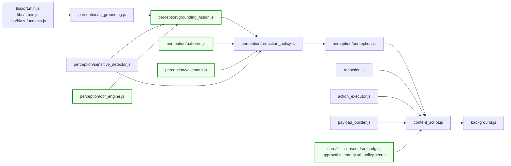

⚠️ Two ordering bugs to fix while here: `background.js:50-59` omits `libs/*` (so the fallback path loses ONNX *and* BlazeFace), and re-injection is **non-idempotent** — a second `executeScript` throws `SyntaxError: Identifier 'UIGroundingEngine' has already been declared` because these files declare top-level `class`/`const` bindings with no guard. Add `if (window.__sentinelLoaded) return;` at the top of every injected file.

---

## Appendix A — Known prior art (position the deck against these)

Every published system in this space is **phone-side**. None is a browser extension. None fuses DOM text with the pixel mask. None handles Indian identifiers.

| System | Date | Platform | What it does |
| :--- | :--- | :--- | :--- |
| GUIGuard (2601.18842) | Jan 2026 | Android/PC | 3-stage local→remote hybrid, pixel+semantic+latent redaction |
| Anonymization-Enhanced (2602.10139) | Feb 2026 | Android | Trusted local privacy layer, opaque overlays, type-preserving placeholders |
| WebPII (2603.17357) | Mar 2026 | E-commerce | 44,865 images; WebRedact redactor, 0.753 mAP@50 @20ms CPU |
| CAPED (2606.12666) | Jun 2026 | AndroidWorld | Pre-upload leakage suppression, task-necessity-aware exposure |
| PrivAuto (ICSE 2026) | 2026 | Android | Perceive–Scan–Plan–Execute, on-device sanitizer |

**Positioning to claim — and only these three:**

1. **Role-preserving redaction for *acting* agents.** Existing redaction tools redact and stop; an acting agent must still know a password field *exists* so it can act around it without ever reading it. This is what `{id, type, label}` encodes, and it is genuinely yours.
2. **Browser-native delivery.** All prior art is phone-side. A Chrome MV3 / Firefox WebExtension implementation is an uncontested platform.
3. **Indian regulatory PII.** No prior work covers Aadhaar / PAN / GSTIN / IFSC / UPI, and none implements the checksum validators.

**Do not claim:** the local-redact → cloud-reason architecture. It is established.

⚠️ **Verify all arXiv IDs before citing.** The identifiers above came from web search and have not been independently confirmed against the arXiv API.

## Appendix B — Real-world deployment gaps

Beyond the evaluation criteria, these block any actual deployment.

| # | Gap | Why it matters |
| :--- | :--- | :--- |
| 1 | `<all_urls>` on every page, no consent screen | Chrome Web Store review friction; user trust collapse |
| 2 | No approval before irreversible actions | Agent types and submits fabricated PII; the user can neither see nor veto it |
| 3 | Server cost: 1 VLM call + full JPEG per step | Unsustainable at scale; a loop bug burns quota invisibly |
| 4 | 10.9 MB model baked into the extension | No remote update path; a CV fix requires a new extension release |
| 5 | Firefox largely broken | `default_popup` set ⇒ `action.onClicked` dead; `popup.html` not web-accessible ⇒ sidebar iframe blocked |
| 6 | Unencrypted `chrome.storage.local` history | PII-adjacent prose retained indefinitely; bad on shared machines |
| 7 | Aadhaar masking is format-preserving **by law** | UIDAI Reg. 21(mb) requires `xxxx-xxxx####`; full blackout is stricter — defensible, but state the choice |
| 8 | DPDP Act 2023 / PCI-DSS | Redaction protects the *transit* path only. Local DOM still holds unmasked PII, and a `type` action can re-transmit it |
| 9 | Canvas/WebGL, cross-origin iframes, native `<select>`, file pickers, date pickers, drag-drop | Unreachable or no-op |
| 10 | No `key`/`code`/`beforeinput` in synthetic events | OTP fields, input masks, autocomplete widgets, CodeMirror/Monaco all fail |
| 11 | Masking destroys VLM context | Blacking out 30% of a frame degrades grounding — the core tension nobody has measured |
| 12 | No tests, no CI | Every refactor risks regressing the PII guarantee silently |
