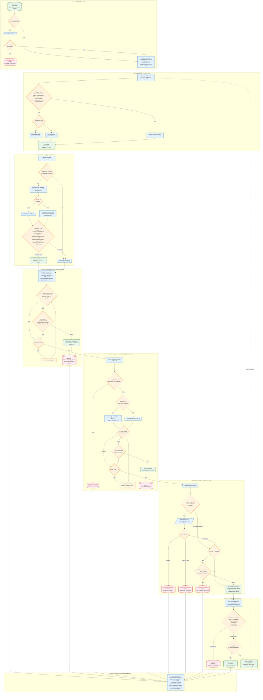

# SentinelAgent v2 — Linear Decision Flow Architecture

```mermaid
flowchart TD
    %% ===================== STYLES =====================
    classDef startNode fill:#e8f5e9,stroke:#2e7d32,stroke-width:2px;
    classDef gateNode fill:#fff3e0,stroke:#ef6c00,stroke-width:2px;
    classDef actionNode fill:#e3f2fd,stroke:#1565c0,stroke-width:1.5px;
    classDef passNode fill:#e8f5e9,stroke:#2e7d32,stroke-width:1.5px;
    classDef abortNode fill:#ffebee,stroke:#c62828,stroke-width:2px;
    classDef retryNode fill:#fff8e1,stroke:#f57f17,stroke-width:1.5px;
    classDef subgStyle fill:#fafafa,stroke:#9e9e9e,stroke-width:1px,stroke-dasharray: 4 4;

    %% =========================================================================
    %% CHECKPOINT 1: INPUT & CONSENT GATE
    %% =========================================================================
    subgraph CP1["1. INPUT & CONSENT GATE"]
        direction TB
        START[("User Trigger\n(step start / field focus / manual)")]:::startNode
        D_CONSENT{"Is domain opted in\nto SentinelAgent?"}:::gateNode
        ACT_CONSENT_UI[/Prompt Consent Dialog/]:::actionNode
        D_USER_CONSENT{"Did user grant\npermission?"}:::gateNode
        ACT_INIT_CYCLE["Initialize Step Cycle\n• Content Script: DOM Fast Path (25 selectors)\n• Service Worker: captureVisibleTab (JPEG q=60)"]:::actionNode
        ABORT_NO_CONSENT[("ABORT: CONSENT_REQUIRED")]:::abortNode

        START --> D_CONSENT
        D_CONSENT -- YES --> ACT_INIT_CYCLE
        D_CONSENT -- NO --> ACT_CONSENT_UI
        ACT_CONSENT_UI --> D_USER_CONSENT
        D_USER_CONSENT -- YES --> ACT_INIT_CYCLE
        D_USER_CONSENT -- NO --> ABORT_NO_CONSENT
    end

    %% =========================================================================
    %% CHECKPOINT 2: COMPUTED OCR TRIGGER GATE
    %% =========================================================================
    subgraph CP2["2. COMPUTED OCR TRIGGER GATE"]
        direction TB
        IN_CP2["Offscreen ML Context\n(YOLO11n + BlazeFace executed)"]:::actionNode
        D_OCR_REQ{"Requires OCR?\n1. Canvas / img / video / iframe covers viewport?\n2. UI detector found text w/o DOM box?\n3. CSS ::before / ::after generated text?"}:::gateNode
        D_OCR_RUNTIME{"Is PaddleOCR.js\nworker available?"}:::gateNode
        ACT_RUN_PADDLE["Run PaddleOCR.js\n(Worker Mode SDK)"]:::actionNode
        ACT_RUN_TESS["Run Tesseract.js\n(WASM Fallback)"]:::actionNode
        ACT_SKIP_OCR["Bypass OCR (DOM covers text)"]:::actionNode
        ACT_FUSION["Grounding Fusion Complete\n(DOM ∩ Vision ∩ BlazeFace ∩ OCR)"]:::passNode

        IN_CP2 --> D_OCR_REQ
        D_OCR_REQ -- YES --> D_OCR_RUNTIME
        D_OCR_REQ -- NO --> ACT_SKIP_OCR
        D_OCR_RUNTIME -- YES --> ACT_RUN_PADDLE --> ACT_FUSION
        D_OCR_RUNTIME -- NO --> ACT_RUN_TESS --> ACT_FUSION
        ACT_SKIP_OCR --> ACT_FUSION
    end

    ACT_INIT_CYCLE --> IN_CP2

    %% =========================================================================
    %% CHECKPOINT 3: PII VALIDATION & THRESHOLD GATE
    %% =========================================================================
    subgraph CP3["3. PII VALIDATION & THRESHOLD GATE"]
        direction TB
        IN_CP3["Extracted Grounded Elements"]:::actionNode
        D_PII_MATCH{"Matches PII Pattern?\n(10 categories in registry)"}:::gateNode
        ACT_VALIDATE["Run Algorithmic Validators\n(Verhoeff · Luhn · mod-36 · PAN 4th-char)"]:::actionNode
        D_VALIDATOR{"Checksum\nPassed?"}:::gateNode
        ACT_CONF_HIGH["Confidence = HIGH Tier"]:::actionNode
        ACT_CONF_LOWER["Confidence = LOWER Tier\n(Failed checksum NEVER drops redaction)"]:::actionNode
        D_TIER{"Confidence ≥ Tier Threshold?\n• Critical (Pwd/OTP/CVV): ALWAYS (≥0.00)\n• High (Aadhaar/Card/PAN): conf ≥ 0.60\n• Medium (Email/Phone): conf ≥ 0.75\n• Digit-run (12-16 digits): conf ≥ 0.50"}:::gateNode
        ACT_MARK_REDACT["Mark Box for Redaction\n(+6px pad · IoU ≥ 0.3 merge)"]:::passNode
        ACT_KEEP_CLEAR["Preserve Plain Element"]:::actionNode

        IN_CP3 --> D_PII_MATCH
        D_PII_MATCH -- NO --> ACT_KEEP_CLEAR
        D_PII_MATCH -- YES --> ACT_VALIDATE --> D_VALIDATOR
        D_VALIDATOR -- PASS --> ACT_CONF_HIGH --> D_TIER
        D_VALIDATOR -- FAIL --> ACT_CONF_LOWER --> D_TIER
        D_TIER -- YES (REDACT) --> ACT_MARK_REDACT
        D_TIER -- NO (KEEP) --> ACT_KEEP_CLEAR
    end

    ACT_FUSION --> IN_CP3

    %% =========================================================================
    %% CHECKPOINT 4: FAIL-CLOSED HARD GATE
    %% =========================================================================
    subgraph CP4["4. FAIL-CLOSED HARD GATE (Zero-Trust Privacy)"]
        direction TB
        ACT_REDACTION["Execute Redaction Fork:\n• Pixel: Solid-black #000000 on Canvas 2D + PNG encode\n• Structural: Keep stable id (el_N) & type; mask text"]:::actionNode
        D_HARD_PIXEL{"1. PIXEL VERIFICATION:\nIs every pixel inside all\nsensitive boxes == #000000?"}:::gateNode
        D_HARD_SCHEMA{"2. SCHEMA ENFORCEMENT:\nDoes elements[] contain\nONLY {id, type, label}?"}:::gateNode
        D_HARD_RETRY{"Retry Count < 1?"}:::gateNode
        ACT_RETRY_RED["Re-run Redaction Engine"]:::retryNode
        ABORT_HARD_GATE[("ABORT: PRIVACY_GATE_FAILED\n(Frame blocked, zero network)")]:::abortNode
        PASS_TRUST_BOUNDARY["PASS TRUST BOUNDARY\nSanitized Frame + Stripped Elements"]:::passNode

        ACT_REDACTION --> D_HARD_PIXEL
        D_HARD_PIXEL -- PASS --> D_HARD_SCHEMA
        D_HARD_PIXEL -- FAIL --> D_HARD_RETRY
        D_HARD_SCHEMA -- PASS --> PASS_TRUST_BOUNDARY
        D_HARD_SCHEMA -- FAIL --> D_HARD_RETRY
        D_HARD_RETRY -- YES --> ACT_RETRY_RED --> D_HARD_PIXEL
        D_HARD_RETRY -- NO --> ABORT_HARD_GATE
    end

    ACT_MARK_REDACT --> ACT_REDACTION
    ACT_KEEP_CLEAR --> ACT_REDACTION

    %% =========================================================================
    %% CHECKPOINT 5: VLM ROUTING & TARGET VALIDATION GATE
    %% =========================================================================
    subgraph CP5["5. VLM ROUTING & TARGET VALIDATION GATE"]
        direction TB
        IN_CP5["POST /act (HMAC Header + Payload)"]:::actionNode
        D_AUTH{"Auth & Rate Limit\nValid HMAC & <10 req/min?"}:::gateNode
        ABORT_AUTH[("ABORT: HTTP 401 / 429")]:::abortNode
        D_VLM_SELECT{"Model Router:\nLocal Server Available?"}:::gateNode
        ACT_QWEN["Local Qwen3-VL-8B (Primary)\nFallback: Qwen2.5-VL-7B"]:::actionNode
        ACT_GEMINI["Gemini Flash (Opt-in Cloud)"]:::actionNode
        D_VLM_PARSE{"Is Model Output\nValid JSON Action?"}:::gateNode
        D_TARGET_VALID{"Is action.target_id ∈\nrequest.elements?"}:::gateNode
        D_REPAIR_COUNT{"Repair Count < 1?"}:::gateNode
        ACT_REPAIR_PROMPT["Send Repair Prompt\n(Schema reminder + valid element ids)"]:::retryNode
        ABORT_TARGET_ERR[("ABORT: INVALID_TARGET_ID")]:::abortNode
        PASS_ACTION_VALID["Action Validated\n{action, target_id, value}"]:::passNode

        IN_CP5 --> D_AUTH
        D_AUTH -- FAIL --> ABORT_AUTH
        D_AUTH -- PASS --> D_VLM_SELECT
        D_VLM_SELECT -- YES --> ACT_QWEN --> D_VLM_PARSE
        D_VLM_SELECT -- NO --> ACT_GEMINI --> D_VLM_PARSE
        D_VLM_PARSE -- VALID --> D_TARGET_VALID
        D_VLM_PARSE -- INVALID --> D_REPAIR_COUNT
        D_TARGET_VALID -- YES --> PASS_ACTION_VALID
        D_TARGET_VALID -- NO --> D_REPAIR_COUNT
        D_REPAIR_COUNT -- YES --> ACT_REPAIR_PROMPT --> D_VLM_PARSE
        D_REPAIR_COUNT -- NO --> ABORT_TARGET_ERR
    end

    PASS_TRUST_BOUNDARY --> IN_CP5

    %% =========================================================================
    %% CHECKPOINT 6: ACTION SAFETY & APPROVAL GATE
    %% =========================================================================
    subgraph CP6["6. ACTION SAFETY & APPROVAL GATE"]
        direction TB
        IN_CP6["Validated Action Proposal"]:::actionNode
        D_RISK{"Is Action High-Risk?\n(type / submit click / navigate)"}:::gateNode
        ACT_SHOW_APPROVAL[/Show Approval UI\nSanitized preview + 30s timer/]:::actionNode
        D_USER_ACTION{"User Approval?"}:::gateNode
        ABORT_DENIED[("ABORT: APPROVAL_DENIED")]:::abortNode
        ABORT_TIMEOUT[("ABORT: APPROVAL_TIMEOUT")]:::abortNode
        D_NAV_CHECK{"Is Action == navigate?"}:::gateNode
        D_URL_ALLOW{"URL Policy Check:\n1. https: scheme?\n2. Domain in allow-list?"}:::gateNode
        ABORT_URL[("ABORT: URL_POLICY_VIOLATION")]:::abortNode
        ACT_DISPATCH["Dispatch Action to DOM:\n• React-native setter bypass\n• Synthetic event chain\n• Shadow DOM pierced"]:::passNode

        IN_CP6 --> D_RISK
        D_RISK -- NO (click/scroll/none) --> D_NAV_CHECK
        D_RISK -- YES --> ACT_SHOW_APPROVAL --> D_USER_ACTION
        D_USER_ACTION -- APPROVED --> D_NAV_CHECK
        D_USER_ACTION -- DENIED --> ABORT_DENIED
        D_USER_ACTION -- TIMEOUT (30s) --> ABORT_TIMEOUT
        D_NAV_CHECK -- YES --> D_URL_ALLOW
        D_NAV_CHECK -- NO --> ACT_DISPATCH
        D_URL_ALLOW -- PASS --> ACT_DISPATCH
        D_URL_ALLOW -- FAIL --> ABORT_URL
    end

    PASS_ACTION_VALID --> IN_CP6

    %% =========================================================================
    %% CHECKPOINT 7: FSM & BUDGET GOVERNOR GATE
    %% =========================================================================
    subgraph CP7["7. FSM & BUDGET GOVERNOR GATE"]
        direction TB
        ACT_WAIT["Await MutationObserver Wake Signal\n(800ms debounce timeout)"]:::actionNode
        D_BUDGET{"Budget Governor Check:\n• Steps ≥ 50 maxSteps?\n• Wall time ≥ 300s maxWallMs?\n• Cost ≥ $0.50 maxSpendUsd?"}:::gateNode
        ABORT_BUDGET[("ABORT: BUDGET_EXCEEDED")]:::abortNode
        D_TASK_DONE{"Is Task Goal Met\n(or explicit 'none' stop)?"}:::gateNode
        TERM_SUCCESS[("SUCCESS: TASK_COMPLETED")]:::startNode
        ACT_NEXT_CYCLE["FSM Transition: NEXT_STEP\n(Increment step counter, update session)"]:::passNode

        ACT_WAIT --> D_BUDGET
        D_BUDGET -- EXCEEDED --> ABORT_BUDGET
        D_BUDGET -- WITHIN LIMITS --> D_TASK_DONE
        D_TASK_DONE -- YES --> TERM_SUCCESS
        D_TASK_DONE -- NO --> ACT_NEXT_CYCLE
    end

    ACT_DISPATCH --> ACT_WAIT
    ACT_NEXT_CYCLE -.->|"Loop to next step"| IN_CP2

    %% =========================================================================
    %% TELEMETRY RECORDER
    %% =========================================================================
    subgraph TELEMETRY["TELEMETRY & LOGGING (All Terminal Exits)"]
        direction LR
        RECORDER["Record Exit State:\n• 5-Stage Timers (capture / perception / redaction / server / total)\n• Heap Delta (Chrome performance.memory / Firefox background context)\n• Terminal Reason Code (SUCCESS / ABORT_*)"]:::actionNode
    end

    ABORT_NO_CONSENT --> RECORDER
    ABORT_HARD_GATE --> RECORDER
    ABORT_AUTH --> RECORDER
    ABORT_TARGET_ERR --> RECORDER
    ABORT_DENIED --> RECORDER
    ABORT_TIMEOUT --> RECORDER
    ABORT_URL --> RECORDER
    ABORT_BUDGET --> RECORDER
    TERM_SUCCESS --> RECORDER
```
