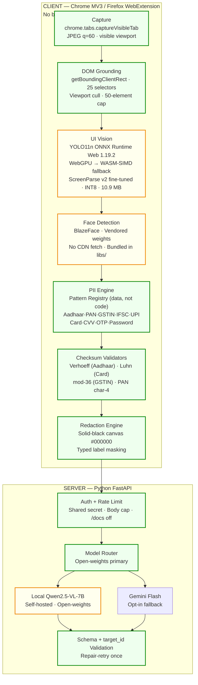
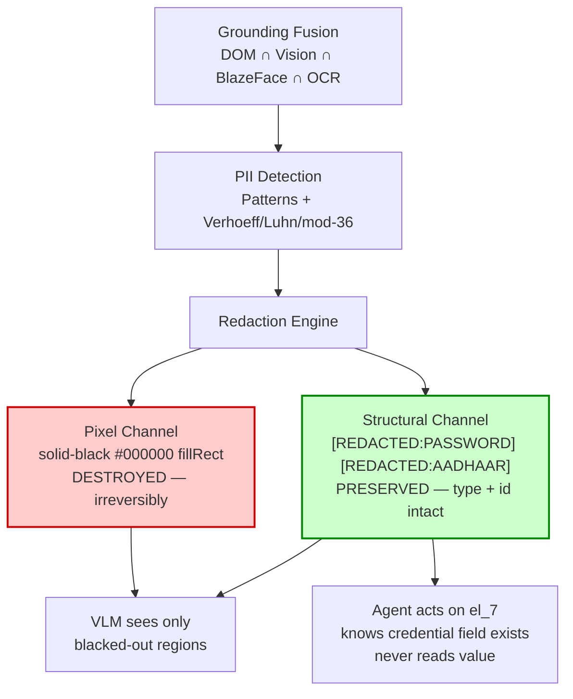

# Page 3 — Technical Approach (Preparation Target)

**Purpose:** The slide as it *should* exist at submission — nothing from current code, only the prepared/expected state.

---

## Slide Layout

Two panels, equal weight:

| Left: **Technology Stack** (corrected, verifiable) | Right: **Two-Channel Redaction Fork** (the architecture) |
| :--- | :--- |

---

## 1. Technology Stack (Left Panel)

**Caption:** "Chrome MV3 · ONNX Runtime Web · ScreenParse-v2 YOLO11n · Qwen2.5-VL local"

---

## 2. Two-Channel Redaction Fork (Right Panel)

**Caption:** "Pixel channel destroyed · Structural channel preserved · Same element id bridges both"

---

## Slide-Ready Checklist

| Item | Status |
| :-- | :-- |
| YOLO11n fine-tuned on ScreenParse v2, exported, replaces stock model | ☐ |
| BlazeFace weights vendored in `libs/blazeface/`, no `tfhub.dev` fetch | ☐ |
| `ort.env.wasm.wasmPaths = chrome.runtime.getURL('libs/')` set before session | ☐ |
| Local Qwen2.5-VL-7B deployed, behind `ModelRouter` | ☐ |
| Verhoeff / Luhn / mod-36 / PAN-char4 validators wired | ☐ |
| Pattern registry as data (`perception/patterns.js`) | ☐ |
| Redaction: PNG re-encode (no JPEG chroma leakage) | ☐ |
| Payload contract: `{id, type, label}` only — no value field ever constructed | ☐ |

---

## What This Page Communicates

1. **Stack is real, auditable, and browser-native** — no hidden build, no TypeScript claim, no phantom MiniLM
2. **Architecture is the two-channel fork** — this is the only novel claim; everything else is implementation
3. **Open-weights primary** — PS-compliant; cloud is opt-in
4. **Indian PII is explicit** — validators named, not implied
5. **Everything on the left is either already true or fixable in one afternoon** — nothing is aspirational